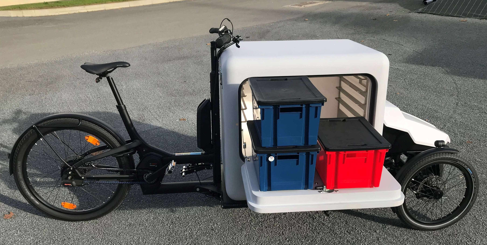

# MENU
[PROFIL](/index.md) | [VELO CARGO FRIGO](/velo_CO2.md) | [VELO ELECTRIQUE](/velo_base.md)

## VELO CARGO GLACIERE CO2

### FONCTIONS DU VELO
- Base de vélo électrique [Sortimo ProCargo](https://www.mysortimo.com/en/products/cargo-bike-procargo-ct1) 
- Transformation Froid autonome (type neige carbonique)
- Suivi « Local » de la transformation par Smartphone via Bluetooth
- Suivi « Distant » de la transformation via un site Web dedié

### MES MISSIONS
- Définition des architectures électronique et logicielle
- Développement du Logiciel embarqué et les communications sans fil (Bluetooth et SigFox) 
- Développement de l'Application pour SmartPhone Android
- Développement du site Web [Back Office](http://ginnov.gruau.free.fr/ "Plateforme")  (HTML / CSS / php / SQL)
