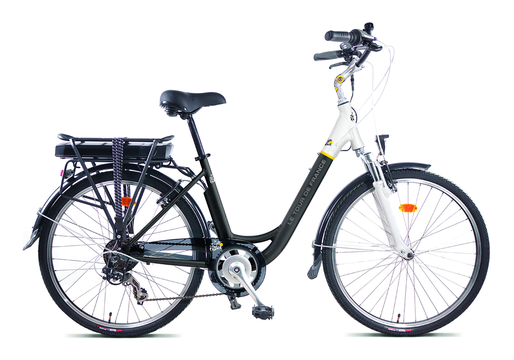

# MENU
[PROFIL](/index.md)
[VELO CARGO FRIGO](/velo_Cargo_CO2.md)
[VELO ELECTRIQUE](/velo_base.md)

## OPTIMISATION VELO ELECTRIQUE

### FONCTIONS
- Modification contrôle moteur
  - Mise en place Cartographie selon « vitesse véhicule » et « fréquence pédalage »
  - Estimation du couple pédale sans capteur  - en cours
- Amélioration de la fonction batterie
  - Ajout mesure courant pour Gestion  Jauge « précise »
- Remplacement de l’afficheur minimaliste par application Android
  - Ajout fonction Vitesse / Compteur / Jauge / Fréquence pédalage
  - Ajout activation feu arrière (Freinage et Nuit) - en cours

### MISSIONS
- Définition d’architecture électronique et logiciel
- Développement Logiciel embarqué et communication (Bluetooth) 
- Développement Application pour SmartPhone Android
- Développement Logiciel Diagnostic
