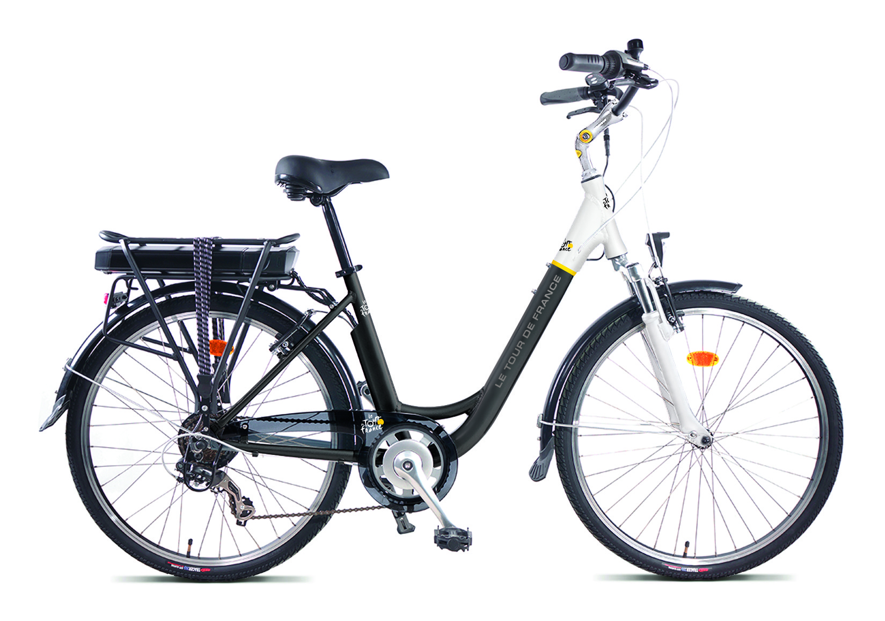

## [PROFIL](/index.md) | [VELO CARGO FRIGO](/velo_CO2.md) | [VELO ELECTRIQUE](/velo_base.md)

## OPTIMISATION VELO ELECTRIQUE

### FONCTIONS DU VELO
- Modification du contrôle moteur
  - Mise en place d'une Cartographie selon la « vitesse du vélo » et « cadence de pédalage »
  - Estimation du couple pédale sans capteur
- Amélioration de la fonction batterie
  - Ajout d'une mesure de courant pour la Gestion d'une Jauge « fiable »
- Remplacement de l’afficheur minimaliste par une application Android
  - Affichage des fonctions "Vitesse / Compteur kilometrique / Jauge Batterie / Cadence pédalage"
  - Activation du feu arrière selon le freinage et la nuit
- Mise en place de fonctions Diagnostic
  - Modification des paramètres
  - Gestion des codes défauts du systême
  - Suivi des données utilisateur "Autonomie / taux de Service /.."

### MES MISSIONS
- Définition des architectures électronique et logicielle
- Développement du Logiciel embarqué et de la communication Bluetooth 
- Développement de l'Application pour SmartPhone Android
- Développement du Logiciel Diagnostic associé
