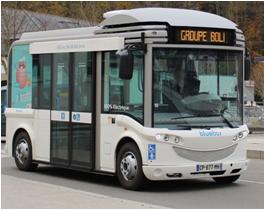

### [PROFIL](/index.md) | [VEHICULES ELECTRIQUES](/vu.md) | [VELOS ELECTRIQUES](/velo.md)

## BLUEBUS BOLLORE

### MES MISSIONS
- Définition complète de l’architecture électronique du véhicule
  - 10 calculateurs sur 3 reseaux CAN
- Intégration électronique des composants avec partenaires internationaux
  - Motorisation électrique par [CEBI](https://www.cebi.com/en/electric-vehicle-components)
  - Batterie Lithium [BOLLORE](https://www.blue-solutions.com/en/blue-solutions/technology/batteries-lmp/) et Borne de Charge [IER](https://www.ier.com/en/cities-businesses/)
  - Fonctionnalités Bus par solution multiplexée [ACTIA](https://www.actia.com/fr/solutions/gestion-electronique-du-vehicule/architecture-electronique-vehicule/architecture-electronique-vehicules-commerciaux)
  - Porte électrique [BODE](https://www.schaltbau-bode.com/product-category/bus-door-systems/) et Suspension Pneumatique [KNORR BREMSE](https://www.knorr-bremsecvs.com/en/products_1/electronicsystems/electronicsystems.jsp)
- Définition et développement logiciel de diagnostic
  - Compatible avec outil des concessionnaires Poids Lourds
- Suivi des essais de validation et Homologation véhicule
- Prise en compte des contraintes liées à la production

## FOURGON ELECTRON GRUAU

### MES MISSIONS
- Définition électronique des composants du véhicule
  -  Analyse des besoins produit
  -  Etablissement des Cahier des charges techniques
- Mise au point des composants et suivi des évolutions avec les partenaires industriels
  - Motorisation électrique [ACTIA](https://www.actia.com/fr/solutions/electronique-de-puissance/traction-electrique)
  - Batterie Lithium [E4V](http://www.e4v.eu)
  - Chargeur [BRUSA](https://www.brusa.biz/portfolio/nlg667/)
  - Calculateur [ETA](http://www.e-t-a.fr/) des accessoires (Climatisation, pompe à vide, blocage reducteur)

