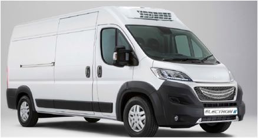

### [PROFIL](/index.md) | [VEHICULES ELECTRIQUES](/vu.md) | [VELOS ELECTRIQUES](/velo.md)

## BLUEBUS BOLLORE

### RESPONSABLE DEVELOPPEMENT ELECTRONIQUE |  2003 à 2016

### MES MISSIONS
- Définition de l’architecture électronique du véhicule
- Intégration électronique des composants avec partenaires internationaux
- Motorisation électrique MES DEA
- Batterie Lithium BOLLORE et Borne de Charge IER
- Fonctionnalités Bus par solution multiplexée ACTIA
- Porte électrique BODE et Suspension Pneumatique KNORR BREMSE
- Développement outil de diagnostic
- Suivi des essais de validation et Homologation véhicule
- Prise en compte des contraintes liées à la production

## FOURGON ELECTRON GRUAU

### INGENIEUR MECATRONIQUE |  2016 à 2021

### MES MISSIONS
- Définition électronique des composants du véhicule
- Mise au point des composants et suivi des évolutions avec les partenaires industriels
  - Motorisation électrique ACTIA
  - Batterie Lithium E4V 
  - Chargeur BRUSA
  - Calculateur ETA des accessoires (Climatisation, pompe à vide, blocage reducteur)

