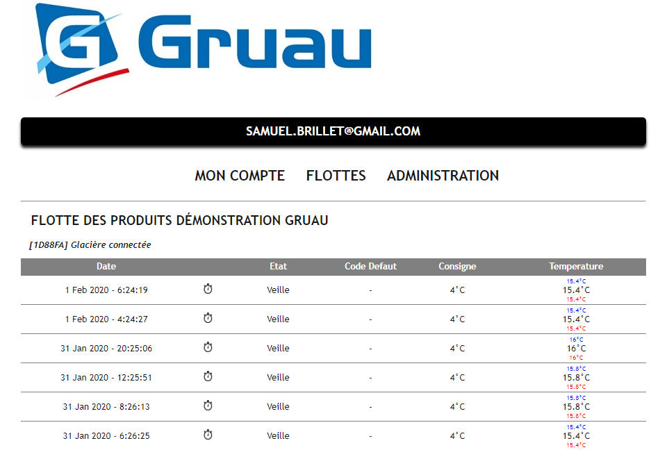

### [PROFIL](/index.md) | [VEHICULES ELECTRIQUES](/vu.md) | [VELOS ELECTRIQUES](/velo.md) | [SITES WEB](/web_dev.md)

## SUIVI DE FLOTTE

**[Vers le site](http://ginnov.gruau.free.fr)**

### FONCTIONS DU SITE
- Suivi des informations des Véhicules frigorifiques connectés (Protocole SigFox)
  - Température de la cargaison et Géolocalisation
  - Ouverture caisse frigorifique et défauts du systême
- Alerte mail en cas de défaillance

### MES MISSIONS
- Définition et codage des comptes utilisateurs (login, mot de passe, niveau accès, groupe)
- Interfacage de l'API SigFox avec la base de données 
- Définition et codage de l'interface avec la base de données (Php et mySQL)
- Défintion et codage de l'interface FrontEnd (html et css)

## PRONOSTICS SPORTIFS

**[Vers le site](http://www.pronostic.online)**

### FONCTIONS DU SITE
- Pronotics des matchs de compétitions internationales de Football (2018, 2021,..)
  - Obtention de points selon écart entre le score réel et le score pronostiqué
  - Mise à disposition de quelques jetons "bonus" pour augmenter ses scores
- Création de groupes "privés" pour jouer entre amis ou collègues
- Site responsive pour utilisation via smartphone

### MES MISSIONS
- Définition et codage des comptes utilisateurs (login, mot de passe, niveau accès, groupe)
- Définition et codage de l'interface avec la base de données (Php et mySQL)
- Définition et codage des algorithmes de calcul des points et de classement (Php et mySQL)
- Défintion et codage de l'interface FrontEnd (html et css)

## PARCOURS VTT MAYENNE

**[Vers le site](http://samuel.brillet.free.fr)**

### FONCTIONS DU SITE
- Mise à disposition de parcours VTT à partir de fichier .gpx
  - Fichier génerés lors de "réelles" sorties en pleine nature Mayennaise
- Affichage des informations des parcours (longueur, denivelé)
- Téléchargement possible des fichiers .gpx pour utilisation par outil externe
- Differents fonds de cartes "Open Source" disponibles
- Site responsive pour utilisation via smartphone

### MES MISSIONS
- Définition et codage de l'interface avec la base de fichiers .gpx (Php et mySQL)
- Interfacage de l'API LeafLet avec la base de fichiers 
